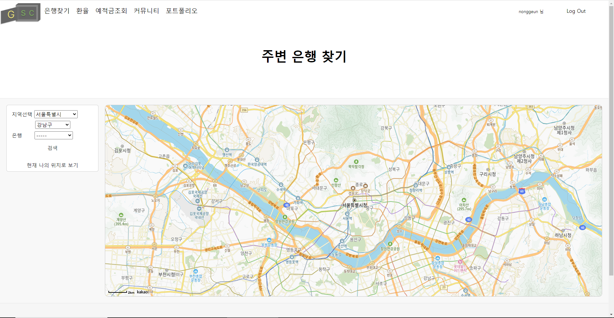

### 금융 상품 추천
#  GSC

## 팀원 정보 및 업무 분담 내역
- 프로젝트 기간 : 2023/05/16 ~ 2023/05/24 

|이름|역할 및 구현 기능|
|---|---|
|백승우 (팀장) |Back End - 은행 검색, 환율, 예적금 금리 조회, 프로필 |
|김근욱|Front End - 전반적 Design, 로고, 로그인, 커뮤니티 |

## 설계 내용 (아키텍처 등) 및 실제 구현 정도
### 🖥 기술 스택
**🌕 front**

- language
    - javascript
- framework
    - Vue3
    - pinia
    - axios

**🌑 back**

- language
    - python
- framework
    - django
    - django-rest-framework
    - dj-rest-auth
    - pillow
    - drf-spectacular

### 🎨 IA
[**🔗 Figma Link**](https://www.figma.com/board/0Jkd377OSxIHJ7f0rfl38Q/IA?node-id=0-1&t=NPPKGBQHAu0I6HZz-0)

- 구현할 페이지 7개를 짜고, 상세 component와 상세 page를 계획함 

## 데이터베이스 모델링(ERD)
[**🔗 ERD drawio Link**](https://www.erdcloud.com/d/abGpw9rn3DkoBJF7N)

## 금융 상품 추천 알고리즘 아이디어
1️⃣. 포트폴리오로 입력하는 나이, 결혼 여부, 자녀 계획, 자산을 통해서 저축 목적을 파악해 추천해주려고 하였으나, 시간 부족으로 점수만 나오게 되었습니다.

## 서비스 대표 기능들에 대한 설명

### 1️⃣ 메인 페이지

- 상품과 관련된 은행 사진을 메인으로 오른쪽에 hover된 페이지를 연결하게 하였습니다.
- 
### 2️⃣ 로그인, 회원가입 페이지

- 회원 가입시 닉네임과 이메일도 customer model을 넣어 입력받을 수 있도록 하였습니다.
- 비밀번호가 8자 미만이거나 중복되는 아이디,이메일, 닉네임의 경우 가입을 할 수 없게 유효성 검사를 진행하였습니다.

### 3️⃣ 포트폴리오 및 프로필

- 추가로 입력받은 포트폴리오 정보(생년월일, 가구원 수, 결혼 여부, 자식 유무, 연봉, 가입 상품)를 포트폴리오 메인페이지에 출력하였습니다.
- 포트폴리오 수정하는 페이지에 상품 가입 폼을 만들어 추가하였습니다.
- 프로필에는 가입 시 입력한 이름, 닉네임, 아이디가 출력하였습니다.

### 4️⃣ 예적금 조회

- 금융 상품 비교 페이지는 예금과 적금 2개의 탭으로 나뉘어져 있습니다.
- 각 페이지에서 예금/적금의 전체 정보를 볼 수 있으며, 각각의 이자율에 따라 오름차순, 내림차순으로 정렬이 가능하며 특정 은행의 상품만을 볼 수도 있습니다.

### 5️⃣ 환율 계산 페이지

- 원화 -> 타국 , 타국 -> 원화로의 환전이 가능합니다.
- 환전 버튼을 누르거나 enter를 칠 시 환율 계산을 할 수 있습니다.
- 
### 6️⃣ 주변 은행 검색 페이지

- 직접 광역시/도, 시/군/구, 은행을 선택하여 그 지역에 있는 특정 은행을 마커로 확인 할 수 있으며, 현재 나의 위치를 마커로 표시할 수도 있습니다.
- 마커를 클릭하면 은행 지점과 주소를 확인할 수 있습니다.

### 6️⃣ 자유 게시판

- 인증된 사용자(로그인 된)만 게시판에 들어와 글을 작성할 수 있습니다.
- 게시글 CRUD와 댓글 CRD가 가능합니다.
  

## 느낀 점, 후기 등

* 백승우 : 기획이 매우 중요하다고 느꼇습니다. 그리고 생각보다 시간이 빠듯해서 구현을 못 한 부분이 많아 아쉬웠습니다. 초반에 추가로 구현할 것들을 많이 생각했었는데, 다 구현하지 못 한 것 같아 다음 프로젝트에서는 시간관리를 잘 해야겠다고 깨달았습니다. 또한, 페어가 있어 어려웠던 점들을 함께 헤쳐나갈 수 있었고, 밤새 같이 개발하고 디자인 해준 페어에게 감사를 표합니다.

* 김근욱 : 기획하고 개발하면서 첫 프로젝트를 어찌저찌 완료를 했지만 아쉬운 부분이 많았습니다. 먼저 크게 일정 조율을 했지만 지켜지지 않았었고, 열심히 기획을 했지만 기획 의도랑 개발 방향이 조금 달라졌습니다. 이러한 부분은 다음 프로젝트에서 반드시 고쳐야 할 문제점 이었습니다. 2학기에는 확실한 방향을 정해 기획하고 개인 개발 역량을 늘려야 겠습니다. 
